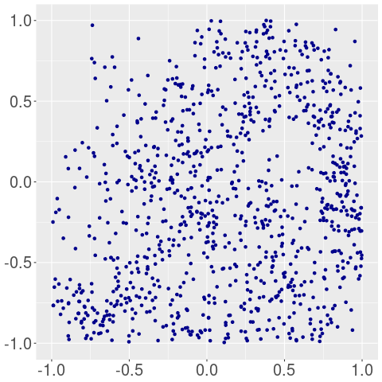

## A. Tests for the project "A comparative study of uniform high dimensional samplers" in Google Summer of Code 2020

### 1. Easy  

I installed the current version of `volesti`. In the following script I generate a 2D H-polytope using the random H-polytope generator with constant seed, equal to 33. I use the function `sample_points()` to illustrate the polytope and the samples I generate. To plot the boundary of the polytope I use boundary sampling, by keeping the extreme points of Random Directions Hit and Run (RDHR). For uniform sampling I use RDHR and Billiard walk. To sample from normal distribution I use Ball walk and Coordinate Directions Hit and Run.  

```{r}
library(volesti)
library(ggplot2)

P = gen_rand_hpoly(2, 8, seed = 33)

boundary_points = sample_points(P, n=10000, random_walk = list("walk" = "BRDHR"))
uniform_points_in_P_1 = sample_points(P, n=2000, random_walk = list("walk" = "RDHR"))
uniform_points_in_P_2 = sample_points(P, n=2000, random_walk = list("walk" = "BiW"))

gaussian_points_in_P_1 = sample_points(P, n=2000, random_walk = list("walk" = "BaW", "walk_length"=50), distribution = list("density" = "gaussian"))
gaussian_points_in_P_2 = sample_points(P, n=2000, random_walk = list("walk" = "CDHR", "walk_length"=50), distribution = list("density" = "gaussian"))
```

To plot the points I use `ggplot2`. For example the following script plots the boundary of the polytope and the uniform sampling obtained by RDHR.  

```{r}
ggplot(data.frame(x = c(uniform_points_in_P_1[1,], boundary_points[1,]),
       body = c(rep("P",2000), rep("BP",10000)), y = c(uniform_points_in_P_1[2,],
       boundary_points[2,])) , aes(x=x, y=y)) + scale_color_manual(values=body) +
       geom_point(shape=20,size=1, color=c(rep("red",2000),rep("black",10000))) +
       labs(x =" ", y = " ")
```

To generate the rest of the plots I just change the first point list and the corresponding color. The following plots are generated.  
Random Directions Hit and Run  

Billiard walk  

Ball walk  

Coordinate Directions Hit and Run  


### 2. Medium

I generate a 100-dimensional hypercube and sample 1000 uniform points from it with all the random walks implmented in `volesti` and walk length = 10, 20, 30, ..., 100. The following script shows how one could obtain those samples with Billiard walk and generate the plots with `ggplot2`.  

```{r}
for (i in c(1, seq(10, 100, by = 10))){
  points = sample_points(P, n=num_of_points, random_walk = list("walk" = "BiW", "walk_length" = i))
  projected_points = data.frame( x=points[1,], y=points[2,] )
  plot = ggplot(projected_points, aes(x=x, y=y))+geom_point(color="red")
  plot_list[[i]] = plot
}
```
For the rest of the random walks I just change the color of the ploted points.

Billiard walk  


Ball walk  





Random Directions Hit and Run  


Coordinate Directions Hit and Run  


Notice that Billard walk samples almost perfect uniformly distributed points. Ball walk and Random Directions Hit and Run converges with the same rate to the uniform distribution. Coordinate Directions Hit and Run is the worst for small walk length but as the walk length increases the sample becomes almost perfect.
